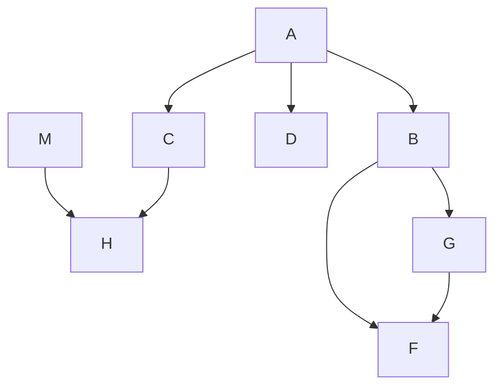
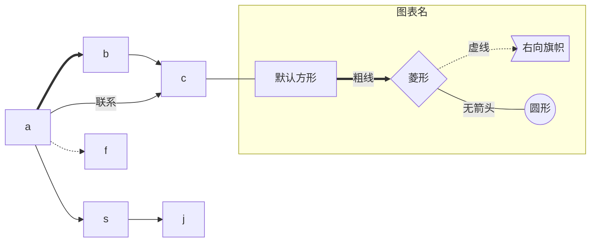
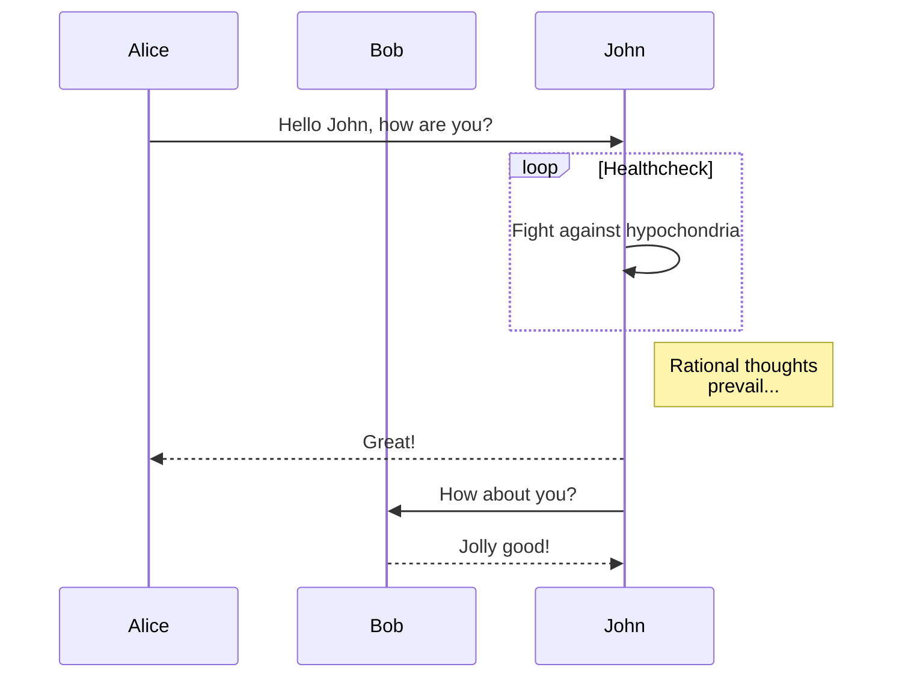
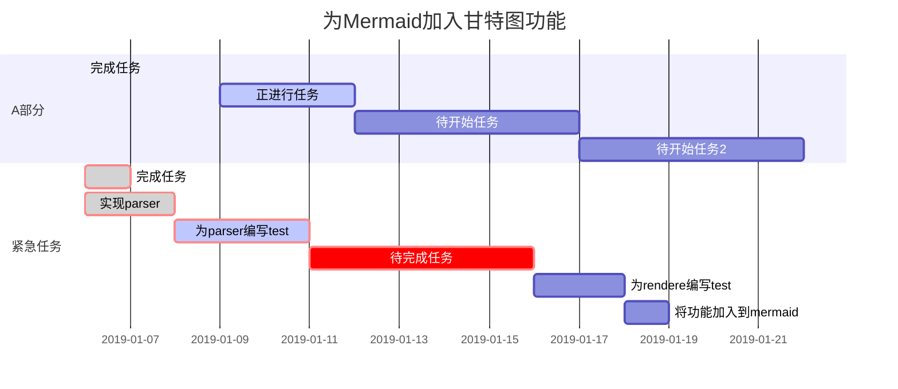

# Markdown
---

## Introduction

This is my sample project in EE.
Except this,
This is a repositories of Markdown examples.
Try Markdown on VSCode, etc.

## Code

```python
print(
    Hello Markdown!
)
```
# Table
| Name | 
| ---- |

## Mermaid







![[pic.png]]




